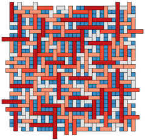

# Procrystalline Lattices
Monte Carlo code written in C++ to generate a range of 2D procrystalline lattices based on a range of underlying lattice and node coordinations.

## Background

Procrystalline lattices have atomic units located on a regular array of points, but fewer bonds than the underlying lattice can accommodate [[1]](https://www.nature.com/articles/ncomms10445).
Therefore whilst they may appear crystalline in terms of the atomic positions, the ring structure is disordered and displays no long range order.
2D procrystals can be generated by a zero-temperature Monte Carlo algorithm [TBC].



## Compilation 

Compilation is easiest using CMake.
To compile the code execute the following in terminal:
```commandline
cd src/
cmake .
make
```
It is recommended that in the
```CMakeCache.txt``` you set ```CMAKE_BUILD_TYPE:STRING=Release``` before making.

The generated executable is called ```procrystal.x```.

## Input

The parameters for the calculation can be found in ```procrystal.inpt``` which are read at runtime.
An example input file is given below:
```text:
1: Procrystal Input File
2: ----------------------------------
3: Procrystal Properties
4: tri          lattice type (sq/tri/snub/isosnub/trihex/hex)
5: 3           node coordination
6: pattern2      link orientations (random/pattern1/pattern2)
7: 1 1 0 0 1 0     pattern code
8: 8         lattice dimension
9: ----------------------------------
10: Monte Carlo Parameters
11: 0           random seed
12: 0.0         temperature
13: 1          samples
14: ----------------------------------
15: Output
16: ./output/example   output prefix
17: 1          write samples
18: 0           calculate environments
19: 0           calculate rdfs
20: 0.02        RDF delta
21: 0           calculate sk
22: 0.01        sk delta
23: 100           n max
24: ----------------------------------
```

### Procrystal Properties 

These options determine the nature of the procrystalline lattice.

* Lattice type: underlying regular or semi-regular lattice for the atomic positions.
* Node coordination: number of bonds for each atom.
* Link orientations: orientation of bonds for each atom. Random allows any orientation, pattern1 a specified orientation which is chiral, pattern2 a specified orientation which is a racemic mixture.
* Pattern code: applies if pattern1 or pattern2 selected and defines bond orientations. Here 1 is used to specify bonds, 0 an absence. The pattern total must match the node coordination.
* Lattice dimension: controls size of the lattice. Only certain values are allowed depending on the underlying lattice type.

### Monte Carlo Parameters

These options control the Monte Carlo process.

* Random seed: initialiser for random number generator. The same seed gives the same lattice.
* Temperature: temperature for Metropolis criterion. Zero-temperature seems to work well in all cases.
* Samples: the number of procrystalline samples to generate.

### Output 

* Output prefix: prefix for output files.
* Write samples: whether to write configurations for visualisation.
* All the other options are legacy really, RDF and structure factor calculations will be crystalline. Set to false.

## Runtime

Running ```procrystal.x``` will read the input file and start the code. A log file, ```procrystal.log```,
will also be produced which is quite verbose.

## Output and Visualisation

After the code has finished there should be several ```.dat``` files, prefixed with your output prefix.

* ```*_pk.dat```: ring statistics aggregated across all procrystalline samples.
* ```*_net.dat```: network metrics, primary ring proportion, mean ring size, variance in ring size distribution, assortativity, Aboav-Weaire analysis  
* Other files containing specific configuration information.

## Examples

Please check out the gallery for some examples, which show some visualisations of example outputs.

## Summary

This is a very brief overview of the code, designed to get some output.
Please let me know if you want to use it for research purposes and we will be happy to help.

